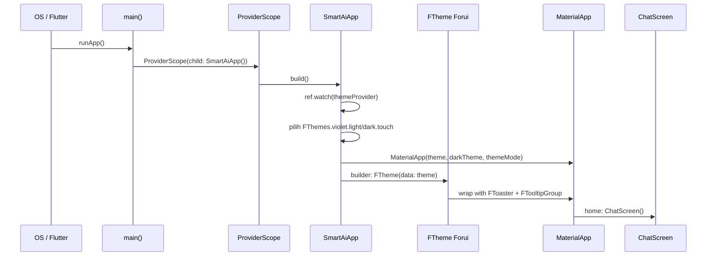

# Bootstrap Aplikasi

```text
# Related Code
- `lib/main.dart`
- `lib/providers/theme_provider.dart`
```

## Startup Sequence



## Key Initialization Steps

1. **`main()`** — Entry point Dart. Membungkus `SmartAiApp` dengan `ProviderScope` dari Riverpod untuk mengaktifkan dependency injection (`lib/main.dart:10153`).

2. **`SmartAiApp.build()`** — `ConsumerWidget` yang membaca `themeProvider`. Memilih tema Forui berdasarkan mode: `FThemes.violet.light.touch` atau `FThemes.violet.dark.touch`. Tema ini dikonversi ke Material theme via `toApproximateMaterialTheme()` (`lib/main.dart:10160-10163`).

3. **MaterialApp + Forui Wrapper** — MaterialApp menerima theme yang sudah dikonversi. `builder` parameter membungkus child dengan `FTheme`, `FToaster`, dan `FTooltipGroup` dari Forui untuk mengaktifkan theming dan utility widgets (`lib/main.dart:10171-10174`).

4. **ChatScreen** — Halaman utama sebagai `home` dari MaterialApp. Memulai dengan data mock dari `ChatProvider`.
