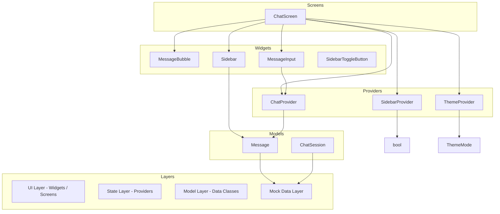
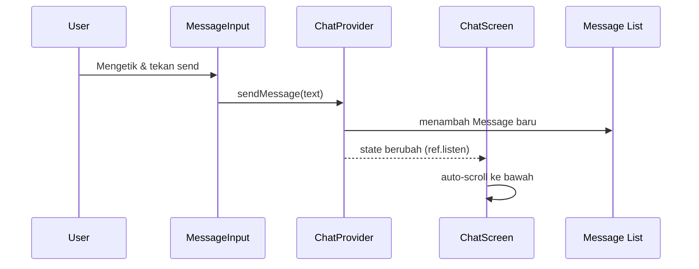
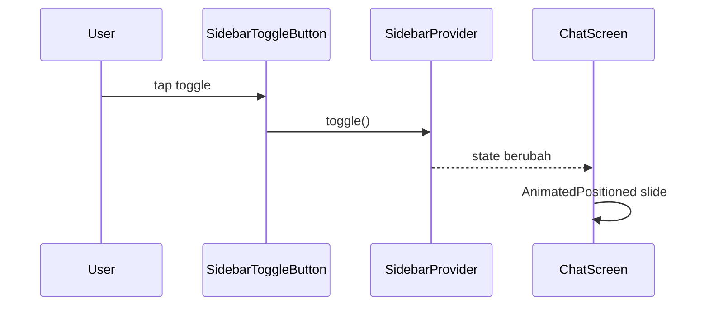

# Arsitektur

```text
# Related Code
- `lib/main.dart`
- `lib/screens/chat_screen.dart`
- `lib/providers/`
- `lib/widgets/`
- `lib/models/`
```

## Design Rationale

Arsitektur SmartAI Chat mengikuti pola **unidirectional data flow** dengan Riverpod sebagai state management. Setiap bagian state (chat messages, sidebar, theme) memiliki `Notifier` sendiri yang independen. Widget `ConsumerWidget` dan `ConsumerStatefulWidget` dari Riverpod digunakan untuk mendengarkan perubahan state secara reaktif.

Forui dipilih sebagai design system untuk menggantikan Material Design standar, memberikan tampilan yang lebih modern dengan kustomisasi tema yang mudah melalui `FTheme` dan `FColors`.

## Component Diagram



## Data Flow — Chat



## Data Flow — Sidebar



## Tech Debt Notes

1. **Tidak Ada Repository Layer** — Data mock langsung di-provider. Untuk produksi, perlu abstraksi repository antara provider dan sumber data.
2. **Sidebar Mengandalkan Mock Langsung** — `Sidebar` widget mengimport `MockSessions` secara langsung, bukan melalui provider. Ini membuat testing dan penggantian data lebih sulit.
3. **Tidak Ada Error Handling** — Provider tidak memiliki mekanisme error atau loading state karena data mock selalu tersedia.
