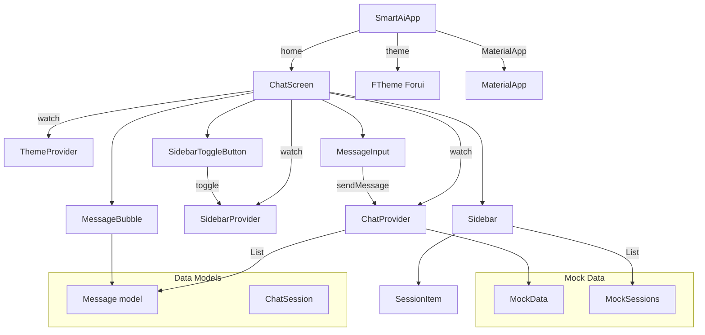
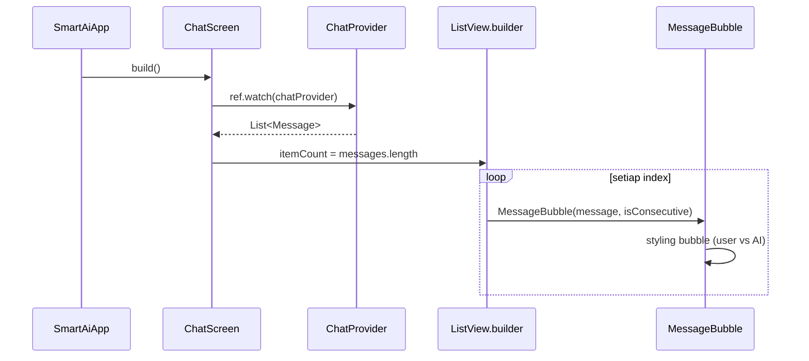
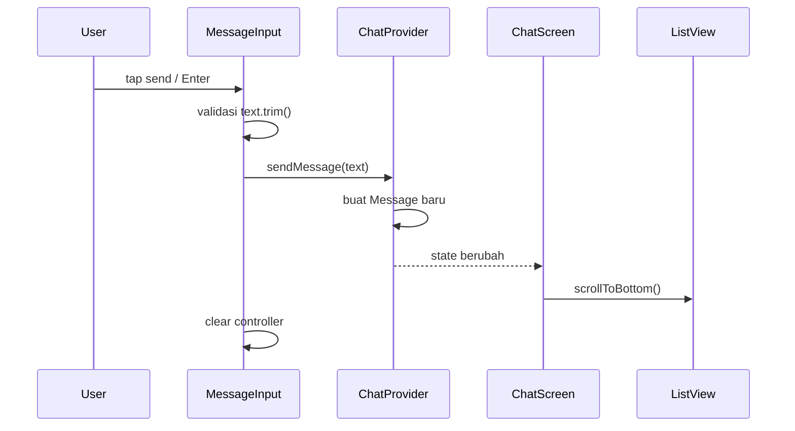

# Komponen Inti

```text
# Related Code
- `lib/models/message.dart`
- `lib/models/session.dart`
- `lib/providers/chat_provider.dart`
- `lib/providers/sidebar_provider.dart`
- `lib/providers/theme_provider.dart`
- `lib/screens/chat_screen.dart`
- `lib/widgets/message_bubble.dart`
- `lib/widgets/message_input.dart`
- `lib/widgets/sidebar.dart`
- `lib/widgets/sidebar_toggle_button.dart`
- `lib/mock/mock_data.dart`
- `lib/mock/mock_sessions.dart`
```

## Component Dictionary

| Komponen | Tanggung Jawab | File |
|----------|---------------|------|
| `SmartAiApp` | Root widget, konfigurasi tema Forui & MaterialApp | `lib/main.dart` |
| `ChatScreen` | Halaman utama: header, message list, input, sidebar overlay | `lib/screens/chat_screen.dart` |
| `ChatNotifier` | State daftar pesan, logic sendMessage | `lib/providers/chat_provider.dart` |
| `SidebarNotifier` | State boolean toggle sidebar | `lib/providers/sidebar_provider.dart` |
| `ThemeNotifier` | State ThemeMode (light/dark) | `lib/providers/theme_provider.dart` |
| `MessageBubble` | Render satu pesan dengan bubble styling | `lib/widgets/message_bubble.dart` |
| `MessageInput` | Input field + send button dengan state lokal | `lib/widgets/message_input.dart` |
| `Sidebar` | Panel navigasi dengan brand header & daftar sesi | `lib/widgets/sidebar.dart` |
| `SidebarToggleButton` | Tombol untuk membuka/menutup sidebar | `lib/widgets/sidebar_toggle_button.dart` |
| `Message` | Model data pesan (id, text, timestamp, sender) | `lib/models/message.dart` |
| `ChatSession` | Model data sesi chat (id, title, isActive) | `lib/models/session.dart` |
| `MockData` | Data pesan dummy untuk development | `lib/mock/mock_data.dart` |
| `MockSessions` | Data sesi dummy untuk development | `lib/mock/mock_sessions.dart` |

## Relationship Graph



## Critical Path — Render Pesan



## Critical Path — Kirim Pesan


