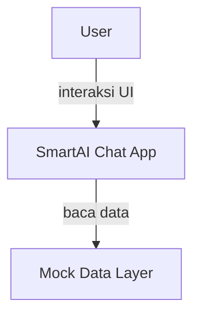

# Ringkasan Proyek

```text
# Related Code
- `lib/main.dart`
- `lib/screens/chat_screen.dart`
- `pubspec.yaml`
```

SmartAI Chat adalah aplikasi chat UI berbasis Flutter yang menampilkan asisten AI bernama **Natsya**. Proyek ini dibangun menggunakan **Forui** sebagai library UI (bukan Material Design murni) dan **Riverpod 3** untuk state management. Fokus utama adalah pada pengalaman UI percakapan yang modern dengan message bubbles bergaya chat, sidebar sesi, dan toggle tema terang/gelap.

Saat ini data chat masih bersifat **mock** (belum terhubung ke backend AI atau API manapun).

## Tech Stack Radar

- **Flutter 3.41+** — Framework UI cross-platform
- **Dart 3.11+** — Bahasa pemrograman
- **Riverpod ^3.3.1** — State management berbasis `Notifier`
- **Forui ^0.21.3** — UI component library dengan tema violet
- **flutter_test** — Unit & widget testing
- **flutter_lints** — Static analysis

## System Context Diagram



Proyek ini adalah aplikasi standalone yang berjalan sepenuhnya di sisi klien. Belum ada backend atau API eksternal.

## Architecture Highlights

1. **State Management Terpusat** — Menggunakan Riverpod `NotifierProvider` untuk chat messages, sidebar toggle, dan theme mode. Setiap state memiliki notifier sendiri yang independen.
2. **Forui Sebagai Design System** — Menggantikan Material widgets standar dengan Forui (`FScaffold`, `FHeader`, `FTextField`, `FTheme`) untuk tampilan yang lebih modern dan konsisten dengan tema violet.
3. **Scroll Behavior Cerdas** — Chat screen memiliki auto-scroll ke pesan terbaru hanya jika user sedang di bagian bawah, memberi kontrol penuh pada user saat men-scroll ke atas.

## Key Risks / Tech Debt

1. **Belum Ada Backend** — Semua data masih mock (`lib/mock/`). Tidak ada integrasi API, database, atau AI asli. Ini adalah pure UI prototype.
2. **Belum Ada Routing** — Menggunakan `MaterialApp` dengan `home:` langsung. Tidak ada GoRouter atau Navigator 2.0. Perlu routing formal saat halaman bertambah.
3. **Manajemen Keyboard** — Input FTextField tidak menangani keyboard show/hide secara eksplisit, yang bisa menyebabkan layout issue di beberapa platform.
