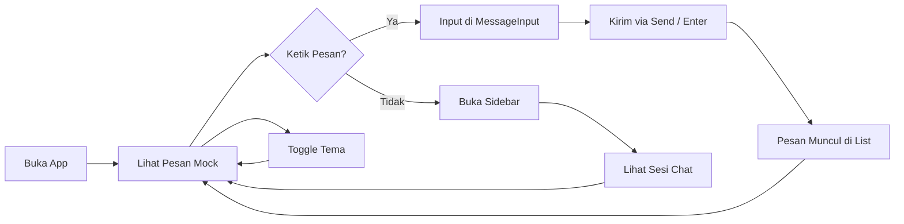
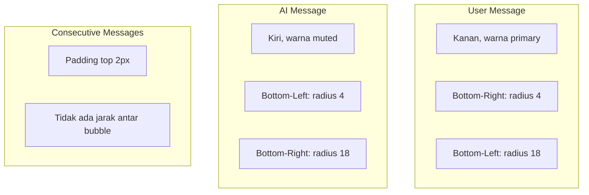

# Model UX

```text
# Related Code
- `lib/screens/chat_screen.dart`
- `lib/widgets/message_bubble.dart`
- `lib/widgets/message_input.dart`
- `lib/widgets/sidebar.dart`
- `lib/widgets/sidebar_toggle_button.dart`
```

## Alur Pengguna



## Persona

Aplikasi ini didesain untuk **pengguna akhir** yang ingin berinteraksi dengan asisten AI Natsya melalui antarmuka chat yang familiar. UI mengadopsi pola percakapan standar (seperti WhatsApp, Telegram) dengan pengirim pesan di sisi berbeda dan bubble styling yang khas.

## Flow — Input & Send

1. User mengetik di `FTextField` dengan hint "Message"
2. Tombol send berubah warna dari `muted` (abu-abu) ke `primary` (violet) saat ada teks valid
3. Tekan tombol send atau Enter → teks dikirim ke `ChatNotifier.sendMessage()`
4. Input field dikosongkan, fokus tetap di field untuk pengetikan berikutnya
5. Jika teks hanya whitespace, field tidak dikosongkan dan pesan tidak dikirim

## Flow — Message Bubbles



Pesan user berada di **kanan** dengan warna latar `primary` (violet), sementara pesan AI di **kiri** dengan warna `muted`. Bubble memiliki efek "chat tail" dengan membedakan radius sudut bawah. Pesan berurutan dari pengirim yang sama memiliki jarak lebih rapat (2px vs 8px).

## Flow — Sidebar

Sidebar muncul dengan animasi slide dari kiri (lebar 260px). Tombol toggle di pinggir kiri layar berputar 180 derajat saat sidebar terbuka. Sidebar menampilkan brand header "Natsya Ai" dengan logo huruf "N" dan daftar sesi chat dengan indikator sesi aktif.
